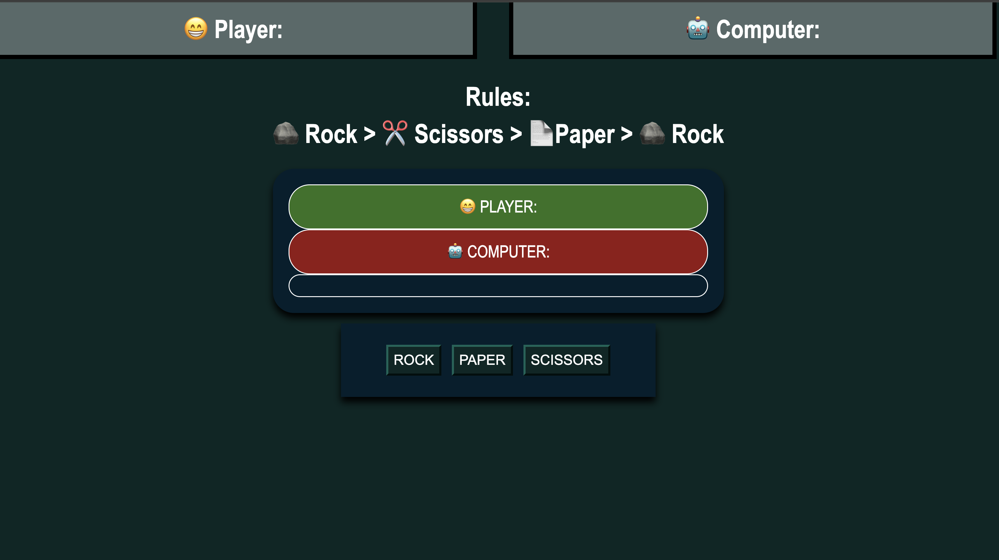

# Rock Paper Scissors Game

## Description

To practice HTML, CSS, and JavaScript I built a rock paper scissors game. I have always loved the idea of making games, so this was a fun first try at a basic classic. I learned a great deal about JavaScript by doing this project. If branches and simply seeing how logic is built into the code was valuable!  

## Table of Contents (Optional)

If your README is long, add a table of contents to make it easy for users to find what they need.

- [Installation](#installation)
- [Usage](#usage)
- [Credits](#credits)
- [License](#license)

## Installation

This project it meant to be played in browser here: https://chrisvulpine.github.io/rock-paper-scissors/

## Usage

Play and have fun! Score is kept at the top and is refreshed when the page is refreshed. 

  

## Credits

Large amount of code framework: http://youtube.com/brocode
 
General Reference: https://www.w3schools.com/ 

## License

N/A

## Badges

## Features

Fun endless game of Rock Paper Scissors against a machine that never tires. 🤖

## Message from the Dev

Enjoy! 🦊 